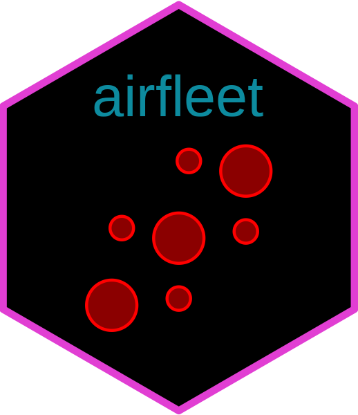

<!-- README.md is generated from README.Rmd. Please edit that file -->

# aiRfleet 

<!-- badges: start -->
<!-- badges: end -->

Fleet device management API wrapper for R.

[FleetDM](https://fleetdm.com/) is a centralized MDM open-source
solution for gathering hosts data via [osquery](https://osquery.io/) and
presenting it in normalized table view.

This package is inspired by
[osqueryr](https://github.com/hrbrmstr/osqueryr) R package.

## Installation

You can install the development version of aiRfleet from
[GitHub](https://github.com/) with:

``` r
# install.packages("pak")
pak::pak("i2z1/airfleet")
```

or

``` r
# install.packages("devtools")
devtools::install_github("i2z1/airfleet")
```

## Usage

### Get Fleet hosts as dataframe

``` r
flt_con <- flt_connection(host = Sys.getenv("FLEET_HOST"),
                          apitoken = Sys.getenv("FLEET_TOKEN"))

hosts_df <- get_hosts(flt_con)
```

### List Fleet queries

``` r
queries_df = query_list(flt_con)
```

### Create query

``` r
query_create(flt_con, name = "users_qry", query = "SELECT * from users;")
```

### Delete query

``` r
query_delete(flt_con, id=51)
```
